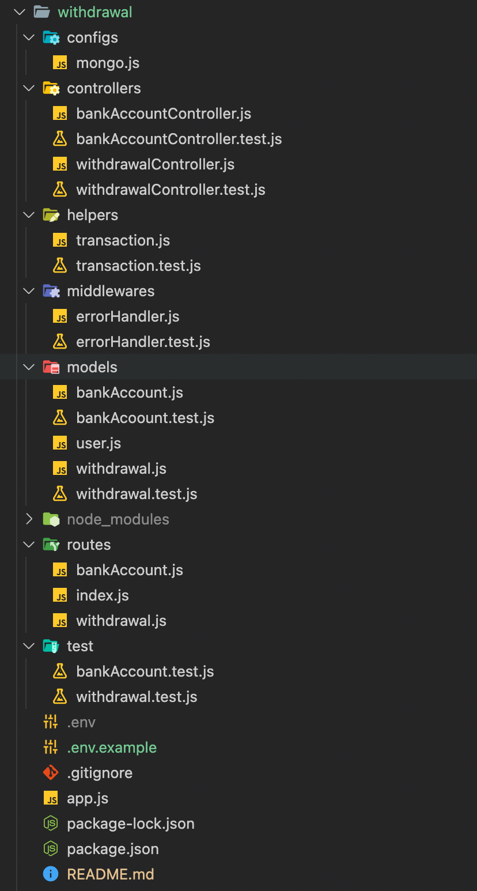

## Code Structure



## Installation
if you don't have install mocha globally
```bash
npm i -g mocha
``` 
if you don't have install nodemon globally
```bash
npm i -g nodemon
```
to install all dependency 
```bash
npm install
``` 

## Setup
```bash
$ cp .env.example .env
```

## Running the app
```bash
#development
npm run dev

```

## Test
```bash
#testing
npm run test

#coverage
npm run coverage
```